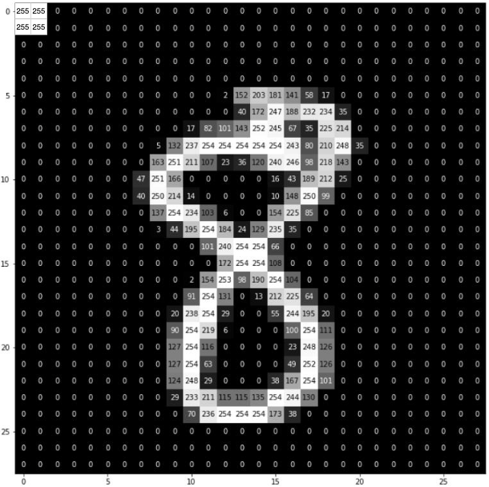

# 目录

1. [说明](#说明)
2. [工具推荐](#工具推荐)
3. [配置实验环境](#配置实验环境)
4. [阅读PyTorch官方教程](#阅读PyTorch官方教程)
5. [关于 Python 的编程建议](#关于-python-的编程建议)
6. [项目一: 图像分类进阶](#项目一图像分类进阶)
7. [项目二: 样本“投毒”](#项目二样本投毒)
# 说明

- 这是一份为深度学习新手准备的学习路线，主要围绕**图像分类**进行设计。

- 这份学习路线以 [PyTorch](https://pytorch.org/) 深度学习框架为主。

- 配置实验环境过程中，需要对应自己的系统 (Windows/Linux/MacOS) 安装软件。

- 出现的“任务”项需要自行查阅资料。

- 参考学习资料：

  - [动手学深度学习](https://zh-v2.d2l.ai/)
  - [Learn PyTorch for Deep Learning](https://github.com/mrdbourke/pytorch-deep-learning)

# 工具推荐

在开始之前，先推荐一些可以提高学习效率的工具：

- 文献管理软件：[zotero](https://www.zotero.org/)
- 笔记软件：[Notion](https://www.notion.so/)
- 为了使用谷歌搜索引擎的梯子工具：[GLaDOS](https://glados.rocks/) (可填写邀请码：UAMXT-VSWIH-ABPTX-XUY1S, 如果有 edu 邮箱，可以免费获得一年的使用时间，参考 [GLaDOS Education](https://glados.rocks/console/education))

# 配置实验环境

为了搭建完整的深度学习实验环境，我们需要安装/配置如下部分：

1. Conda

2. PyCharm

3. PyTorch

其中，前两项可以用来开发一般的Python项目，最后一项 PyTorch 是为深度学习特别安装的。

下面来对它们进行逐一安装/配置。

## Conda

1. 从官方网站 [Miniconda](https://docs.conda.io/en/latest/miniconda.html) 下载 Conda 并进行安装，注意选择 [对应的版本](https://docs.conda.io/en/latest/miniconda.html#id27)。Conda 包含了Python，也就是说，安装完Conda之后不用再单独安装Python。

2. 将 conda 源更换到国内，参考教程 [Anaconda 镜像使用帮助](https://mirror.tuna.tsinghua.edu.cn/help/anaconda/) (需要查阅如何执行 conda 命令)。

任务：

- [ ] conda 的作用是什么？Miniconda 和 Anaconda 的区别是什么？
- [ ] 为什么要更换 conda 源？
- [ ] 常用的 conda 命令有哪些？如何运行这些命令？
- [ ] 用 conda 命令创建一个新的 Python 环境，并切换到这个环境。找到新环境在磁盘上的路径。
- [ ] “查看当前存在哪些虚拟环境”应该用哪一条 conda 命令？

## PyCharm

下载 [PyCharm](https://www.jetbrains.com/pycharm/) 并进行安装。官网提供两个版本的PyCharm：专业版 (Professional) 和社区版 (Community)，前者收费（可以凭edu邮箱免费）后者免费。如果不知道两种版本的区别，建议直接下载社区版。

任务：

- [ ] 了解 PyCharm IDE 的常用操作：如何创建 Project？如何在 Project 中创建文件/文件夹？如何调整程序界面中的字体大小？如何更改文件名？如何在本地窗口显示文件？
- [ ] 在 PyCharm 中指定前面已经配置好的 conda 环境，选择 python 解释器 (interpreter)。
- [ ] 什么是 python 解释器 (interpreter)？
- [ ] 运行一个打印 “hello world”的程序。

## PyTorch

⚠️ 需要注意你的设备是否存在可用GPU

切换到目标 conda 环境，按 [PyTorch](https://pytorch.org/get-started/locally/) 官方安装说明，执行 conda 命令安装 PyTorch，如果你的设备没有可用 GPU (CUDA)，安装CPU版，否则安装GPU版。

## 租用云GPU服务器

如果设备无可用GPU，导致程序运行过于缓慢，可以将程序转移到云GPU服务器上运行。面向深度学习的云GPU服务器一般会自带配置好的环境，开箱即用。

推荐平台：

- [AutoDL](https://www.autodl.com/register?code=37953cd1-0bb7-4042-8d04-a603280714a6) (性价比高，文档详细)

# 阅读PyTorch官方教程

从官网的教程入手：PyTorch [Tutorials](https://pytorch.org/tutorials)

重点关注：

- [PyTorch Recipes](https://pytorch.org/tutorials/recipes/recipes_index.html)

- [Learn the Basics](https://pytorch.org/tutorials/beginner/basics/intro.html#)
- [Introduction to PyTorch - YouTube Series](https://pytorch.org/tutorials/beginner/introyt.html#)
- [Deep Learning with PyTorch: A 60 Minute Blitz](https://pytorch.org/tutorials/beginner/deep_learning_60min_blitz.html#)
- [Learning PyTorch with Examples](https://pytorch.org/tutorials/beginner/pytorch_with_examples.html#)
- [What is torch.nn *really*?](https://pytorch.org/tutorials/beginner/nn_tutorial.html#)
- [Visualizing Models, Data, and Training with TensorBoard](https://pytorch.org/tutorials/intermediate/tensorboard_tutorial.html)

## 任务

学习完官网教程后，搭建一个五层的网络（卷积层\*3，全连接层\*2，每层的卷积核大小，神经元数量等参数自己指定），用 MNIST 数据集进行训练（共训练20个epoch，在第10，15个epoch进行学习率下降）。并完成以下任务：

- [ ] 计算从输入到输出，中间 tensor size 的变化。
- [ ] 每隔2个 epoch 保存一次模型权重（在第2, 4, 6, ..., 18, 20个 epoch 结束后保存）。
- [ ] 依次加载保存的权重，在 MNIST 测试集上进行测试，并将测试准确率以 [numpy](https://numpy.org/doc/stable/) 格式数据保存在本地。
- [ ] 用 [matplotlib](https://matplotlib.org/stable/gallery/index.html) 将上一步保存的数据绘制成曲线。

# 关于 Python 的编程建议

1. 用 [Pathlib](https://docs.python.org/zh-cn/3/library/pathlib.html?highlight=pathlib) 模块操作路径 (代替 `os.path`)。
2. 用 [f-string](https://docs.python.org/zh-cn/3/tutorial/inputoutput.html#formatted-string-literals) 格式化字符串 (代替 `str.format()`)。

# 项目一：图像分类进阶

以一个小型的图像数据集（在文件夹 [data/project_1](https://github.com/geyao1995/DL-CV-guide-for-Chinese-beginners/tree/main/data/project_1_standard_classification) 中）为例，从0开始完成数据的加载，模型的训练和评估。注意以下几点：

1. 整个项目的架构是否清晰？（将代码拆分为多个易读的文件）
2. 是否具有一定的日志信息？（可以借助 [tqdm](https://tqdm.github.io/) 模块和 [logging](https://docs.python.org/zh-cn/3/library/logging.html#module-logging) 模块）
3. 如何加载图片数据？（用两种方式实现，1-继承 [Dataset](https://pytorch.org/docs/stable/data.html#torch.utils.data.Dataset) 类；2-继承 [ImageFolder](https://pytorch.org/vision/stable/generated/torchvision.datasets.ImageFolder.html#imagefolder) 类）
4. 如何管理超参数？（可以借助 [dataclasses](https://docs.python.org/zh-cn/3/library/dataclasses.html#module-dataclasses) 模块）

项目一提供参考代码：见 [code/project_1](https://github.com/geyao1995/DL-CV-guide-for-Chinese-beginners/tree/main/code/project_1_standard_classification)

# 项目二：样本“投毒”

对于一个图像分类任务，当我们**故意改变**神经网络训练或测试过程中的部分图片数据，可以观察到一些意料之外的结果，这些结果能够帮助我们分析，理解神经网络的特性。

我们以MNIST数据集为例，进行一些实验。

**实验一**：对于<u>训练集中</u>所有标签为 “8” 的图片，将其左上角的 $s \times s$ 区域的像素值变为最大（将这种修改方式记为 $\operatorname{T}$ 变换，$s$ 设置为 $2$，如上图所示）。用这种修改后的训练集来训练一个模型，完成以下几点：

1. 显示部分训练图片，以检查是否修改成功（显示修改后的图片和对应标签即可，不需要像上方示例图片一样显示具体像素值）。
2. 模型在原始测试集上的准确率如何？
3. 如果将<u>测试集中</u>所有标签为 “8” 的图片，进行 $\operatorname{T}$ 变换，模型在这种测试集上的表现如何？
4. 如果将<u>测试集中</u>所有标签为 “3” 的图片，进行 $\operatorname{T}$ 变换，模型在这种测试集上的表现如何？
5. 如果<u>训练集中</u>进行 $\operatorname{T}$ 变换的是标签为 “1” 的图片，上述实验的结果又如何？
6. $\operatorname{T}$ 变换时，将 $s$ 修改为 $6$，上述实验的结果又如何？

**实验二**：现用一种新的方式修改训练集。即对原始训练集中的每个类别，都随机选择 $m$ 张图片进行任务一中的 $\operatorname{T}$ 变换（此时训练图片数量仍然是 $60,000$）。将进行 $\operatorname{T}$ 变换后的图片划分到一个新的类别（标签记为 “10”）中。用这一训练集（一共有11个类别）训练一个模型（模型可以将图片分为11个类别中的一类），完成以下几点：

1. 模型在原始测试集上的准确率如何？
2. 如果在测试集的每个类别中，都随机选择 $n$ 张图片，进行 $\operatorname{T}$ 变换（同时改变他们的标签为 “10”），模型在这这些图片上的准确率会如何？请分类别统计。
3. 请调整参数 $s,m,n$ 中的一个或多个，重复研究上面两个问题。

**要求**：

1. 相关绘图用 [matplotlib 库](https://matplotlib.org/) 完成。
2. 请以直观的方式展现上述实验结果（表格，折线图，柱状图，...），一些绘图样例可以参考 [example plots](https://matplotlib.org/stable/gallery/index#examples)。
3. 对实现结果进行分析，必要时可以再设计实验验证分析是否合理。

**参考代码**：无
